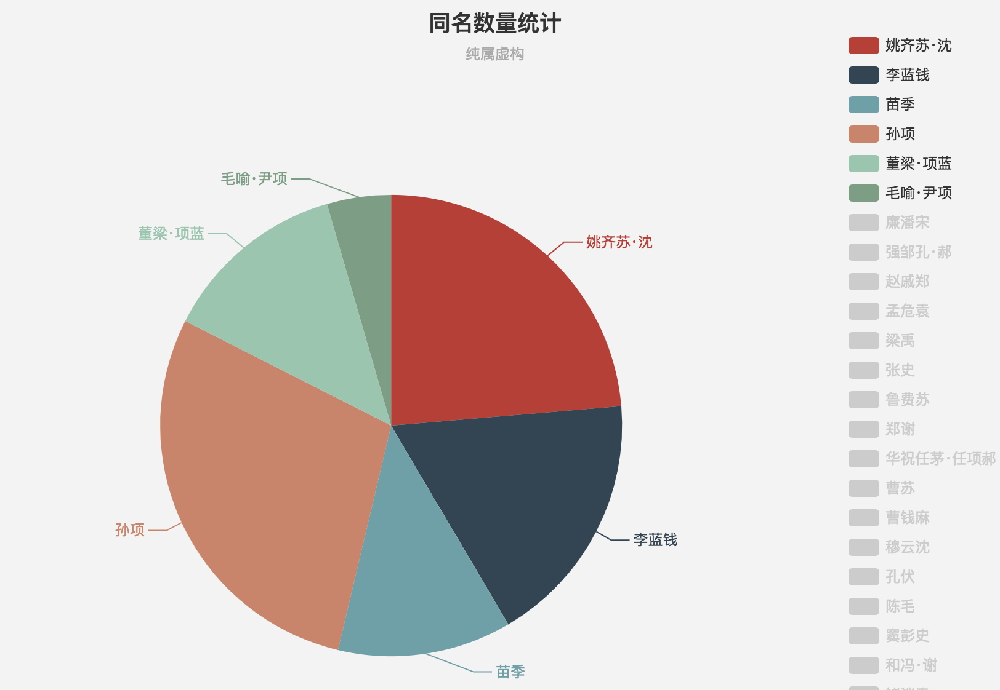
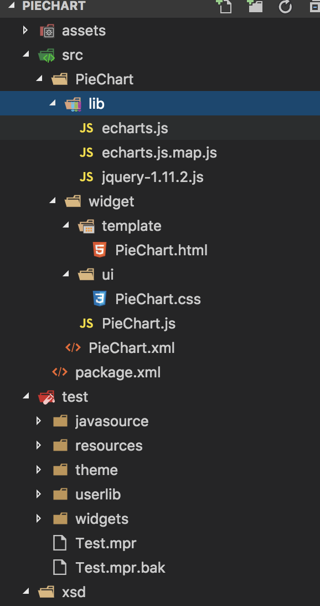
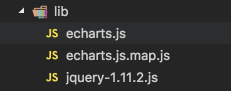

## 这是一个使用mendix开发的饼状图组件




### 一、工程目录说明



- **package.xml**   ：整个组件项目的配置(主要包括widget的xml文件路径和widget存在路径)，一个widget项目可以实现多个组件，只需要在package.xml中配置对应的widgetFiles即可。
- **widget目录**：存放组件的xml文件和Js文件
- **lib 目录**：主要存放一些js的库，比如jquery和echarts.js等
- **PieChart.xml**:饼状图组件的配置文件
- **PieChart.js**:饼状图组件的逻辑代码
- **PieChart.html**:饼状图组件的的html模板


### 二、开发步骤

 1. 使用Brackets工具创建一个widget
 2. 将原本的html文件中的信息删除，并填写自己的内容：

``` html
<div data-dojo-attach-point="MRGaoChart">
    <div data-dojo-attach-point="MRGaoPieChart"></div>
</div>
```
由于使用dojo编写，故注意**一个html文件只有一个顶层div**

3. 编写自己的PieChart.xml配置文件。里面主要配置的是组件通过mendix传递什么参数。
以下面的配置为例：分别需要mendix给组件传递图片的高度，以及饼状图的配置信息，或者说是数据的微流。
**注意：key:可在Js文件中直接使用this.chartHeight得到此属性；其他的类型integer/string/microflow等不知道的，可以在xsd目录中的widget.xsd文件中查询得知**
``` xml
   <property key="chartHeight" type="integer" required="true" defaultValue="700">
            <caption>Chart Height</caption>
            <category>Config</category>
            <description>图表高度</description>
        </property>
        
        <property key="chartConfig" type="string" required="true" multiline="true">
            <caption>Chart Config</caption>
            <category>Config</category>
            <description>饼状图的配置信息</description>
        </property>


        <property key="dataMF" type="microflow" required="false" defaultValue="">
            <caption>Data Microflow</caption>
            <category>Data Source</category>
            <description>饼状图的数据信息（来自微流）</description>
            <returnType type="String" />
        </property>
```

4. **编写PieChart.js。**

    （1）**清除自动生成的属性**
    编写PieChart.js是重中之重，如果之前删除了html文件中的信息
    **请一定要记得将_updateRendering方法中的信息删除，只留下以下部分，否则会报set disable property的错误**。

    ```javascript
    // Rerender the interface.
    _updateRendering: function(callback) {
      logger.debug(this.id + "._updateRendering");
      // Important to clear all validations!
      this._clearValidations();
      // The callback, coming from update, needs to be executed, to let the page know it finished rendering
      this._executeCallback(callback, "_updateRendering");
    },

    ```

    (2) **添加echart组件**
    首先需要在[Echarts官网](http://echarts.baidu.com/)下载 (‘包含所有图表组件的源码，常见的警告和错误提示‘)的源代码。由于echarts.js需要在mendix下运行，**还需要手动创建一个echarts.js.map.js文件。如果不创建则会报错，找不到此文件**。
    


    (3) **添加dojo的json和echart.js**
    其主要添加是在define中添加：
    ```javascript
    //....
    "dojo/json",
    "PieChart/lib/echarts",
    "PieChart/lib/jquery-1.11.2",
    //...
    //一定要注意的是：此处引用的包，和下面function中传入进去的参数顺序一定要一致
    ```

    (4) **在update()中编写逻辑**
   **了解：由于使用的是dojo，那么可以直接使用 this.名称 获取到xml和Html文件中对应配置的信息；比如this.chartWidth可以获取到图表的宽度，this.MRGaoPieChart获取到html文件中(data-dojo-attach-point="MRGaoPieChart">)对应的div**
    除开update(）方法，其余的都是自动生成的，我们需要做的是在this._updateRender()后开始编写：

    ```javascript
    update: function(obj, callback) {
      logger.debug(this.id + ".update");
      this._contextObj = obj;
      this._resetSubscriptions();
      this._updateRendering(callback); // We're passing the callback to updateRendering to be called after DOM-manipulation

      if (!this._contextObj) {
        return;
      }
      //设置图表的宽和高，可以直接通过this.MRGaoPieChart引用到html文件和xml文件中的配置信息
      $(this.MRGaoPieChart).css("width", this.chartWidth);
      $(this.MRGaoPieChart).css("height", this.chartHeight);
      //初始化echarts
      this.myChart = echarts.init(this.MRGaoPieChart);
      //初始化config中图表的配置信息，并将JSon字符串转换成对象
      this.option = eval("(" + this.chartConfig + ")");
    //......
    }
    ```

    (5) **设置组件的点击事件**
    需要注意:点击饼状图的每一分区，需要将数据传递给微流，那么传递的媒介就是通过Widgets.StringParam实体（此实体是自己在mendix新建的一个Modeler，下的model的），将需要传递的数据存储在Widgets.StringParam的params，然后通过mx.data.action将数据传递给微流。
    
    ```javascript
    //点击图表的回调微流事件
    commanCallback: function() {
      //点击图表的回调微流事件
      var mf = this.callBackMF;
      //点击饼状图的每一项
      this.myChart.on("click", function(param) {
        if (mf) {
          mx.data.create({
            //此处的实体为点击后需要将参数数据存储在哪个实体中
            entity: "Widgets.StringParam",
            callback: function(obj) {
              //设置实体中params字段的值为，对应点击项的数据
              obj.set("params", dojoJson.stringify(param.data));
              mx.data.action({
                params: {
                  applyto: "selection",
                  actionname: mf,
                  guids: [obj.getGuid()]
                },
                callback: function() {},
                error: function(error) {}
              });
            }
          });
        }
      });
    ```
